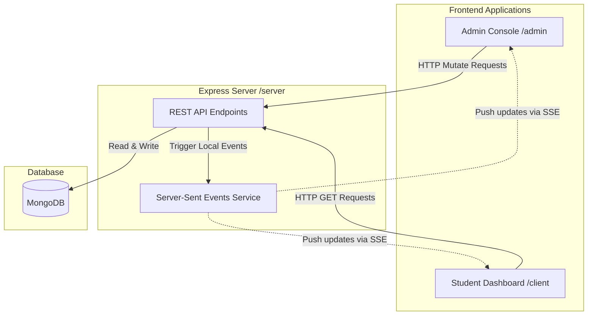

# Where Do I Stand (WDIS)

Where Do I Stand (WDIS) is a real-time placement tracking platform. It replaces legacy spreadsheet-based updates with a modern web platform. WDIS features a dynamic round-based student dashboard and a dedicated administrative console.

## Architecture

This diagram shows the system architecture and data flow between the admin application, student client, backend service, and database.



## Project Structure

The project is structured as a monorepo containing three main applications:

- **server**: Node.js Express server connected to MongoDB.
- **admin**: Next.js application for placement administrators to configure rounds, upload student details, and assign groups or venues.
- **client**: Next.js student-facing dashboard showing placement rounds progress.

## Tech Stack

- **Student Frontend**: Next.js, React, Tailwind CSS, React Query, Zustand.
- **Admin Frontend**: Next.js, React Query, Axios, CSS.
- **Backend**: Node.js, Express, Mongoose.
- **Database**: MongoDB.

## Getting Started

### Environment Variables

Copy the example environment file in the root directory:

```bash
cp .env.example .env
```

Ensure the database URI and backend ports match your local configuration.

### Local Installation

Install dependencies for all folders:

```bash
npm install
npm install --prefix server
npm install --prefix client
npm install --prefix admin
```

Run all services concurrently:

```bash
npm run dev
```

The services will be available at:
- Student App: http://localhost:3000
- Admin App: http://localhost:3001
- Backend API: http://localhost:8080

### Running with Docker

To build and launch the database and applications together:

```bash
docker compose up
```
