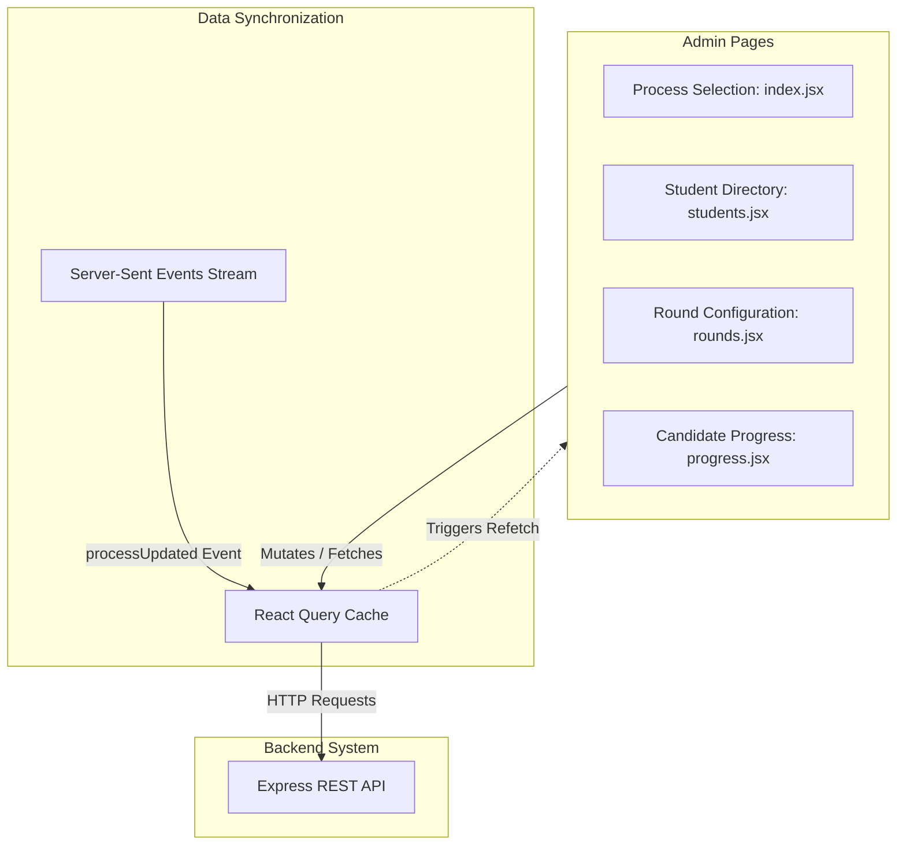

# WDIS Admin Console

The admin console is a Next.js application designed for placement administrators. It provides interfaces for process creation, candidate directory ingestion, stage and venue configuration, and evaluation updates.

## Component and Data Flow

The admin console interacts with the backend REST API via Axios. It manages client-side data state and caching using React Query. A real-time SSE listener automatically invalidates local query caches when database updates occur, triggering automatic UI refetches.

## Page Configurations

- **index.jsx / create.jsx**: Select or initialize placement drives (processes) for specific companies.
- **students.jsx / update.jsx**: Search student profiles, delete records, and upload Excel spreadsheets containing candidate rosters.
- **rounds.jsx**: Add recruitment stages, enable metadata constraints like group indicators, define the maximum group capacity, and configure process-wide predefined venues.
- **progress.jsx**: Evaluation panel supporting:
  - Individual candidate status logging, remarks recording, group placement, and venue assignment.
  - Bulk checkbox selection to assign multiple candidates to the same group in Group Discussion rounds.
  - Group-wide status updates (e.g., transitioning all of Group 1 to Ongoing).

## Styles and UI Theme

The admin panel uses custom CSS definitions tailored for a functional, premium admin dashboard layout. Global styles are defined in `styles/index.css`.
