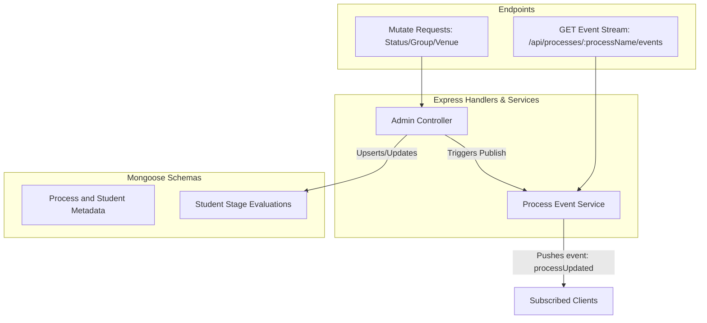

# WDIS Server

The server is a REST API built with Node.js, Express, and MongoDB (via Mongoose) that handles placement process configuration, student data, and round-level results.

## Data Flow and Event Subscription

The server implements a Server-Sent Events (SSE) service to stream process updates to all connected frontends in real-time. When a placement administrator updates candidate statuses, groups, or venues, an event is published through the active SSE stream.

## Directory Structure

- **config**: Database configuration and connection lifecycle.
- **controllers**: Handlers for processes, rounds, candidate evaluations, and Excel uploads.
- **middleware**: Validation, HTTP error handling, and request parsing middlewares.
- **models**: Mongoose schema definitions for processes, embedded student records, and round results.
- **routes**: Routing mapping for administrative and public API endpoints.
- **services**: Real-time event subscription (`subscribeToProcessUpdates`) and broadcast (`publishProcessUpdate`) handlers.
- **utils**: Text normalization, SAP ID normalization, and HTTP error formatters.

## API Documentation

Refer to the main API overview in the root directory for a list of available endpoints.
